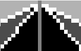
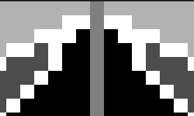
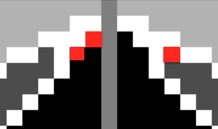

<font size = "6em" ><bold>**PA0: 光栅图形学** &nbsp;&nbsp;</bold></font> <small>2021080070 计14 韩佑硕 </small> 

# **代码结构分析**
## 0. Main
1. 检查输入格式
2. 处理图像  
    2-1. Parse Plain text， 构造CanvasParser类  
    2-2. 构造Image类  
    2-3. 迭代CanvasParser的每个Element（一行对应一个Element），完成画线、圆或填充任务
3. 保存图像

## 1.  Element类
Line，Circle，Fill的母类

## 2. Canvasparser类
: 读入 plaintext， 判断每行输入要画的图像类型（Line, Circle, Fill），并保存在vector中  
本质 ： vector of elements*  
### 例子 ： canvas_basic.txt 为输入的filename
```
512 512 (width, height)
Line 255 0 0 128 1.0 1.0 1.0
Line 255 0 0 300 1.0 1.0 1.0
Line 255 0 511 128 1.0 1.0 1.0
Line 255 0 511 300 1.0 1.0 1.0
Fill 128 0 0.7 0.7 0.7
Fill 400 0 0.7 0.7 0.7
Fill 128 128 0.3 0.3 0.3
Fill 400 128 0.3 0.3 0.3
Circle 255 200 80 1.0 1.0 1.0
Circle 200 300 80 1.0 1.0 1.0
Circle 310 300 80 1.0 1.0 1.0
Fill 255 200 1.0 0.0 0.0
Fill 200 300 0.0 1.0 0.0
Fill 310 300 0.0 0.0 1.0
Fill 220 250 1.0 1.0 0.0
Fill 255 300 0.0 1.0 1.0
Fill 270 250 1.0 0.0 1.0
Fill 255 255 1.0 1.0 1.0
Line 255 0 255 511 0.5 0.5 0.5
Line 0 420 511 420 1.0 1.0 1.0
```

```
512 512 (width, height)
Line 255 0 0 128 1.0 1.0 1.0
{TYPE} {x_A} {y_A} {x_B} {y_B} {color(vector;dim=3)}
Fill 128 0 0.7 0.7 0.7
{TYPE} {c_x} {c_y} {color(vector;dim=3)}
Circle 310 300 80 1.0 1.0 1.0
{TYPE} {c_x} {c_y} {r} {color(vector;dim=3)}
```

## 3. Image类
相当于画板.

## **总结**
1. Canvasparser读取文件，并parse成要画的图形
保存在vector<Element*> ,每个Element是在本次图形中的一些线，圆，Fill
2. Image类的一个实体对应一个最终图像
width， height 和Vector3f(pixel_x,pixel_y,color)
迭代Canvasparser的Elements(vector<Element*>)，draw一些线，圆，Fill
3. Flip，Store

# **算法实现**
只参考 《计算机图形学基础教程（第2版）》 第 2 章的相关内容以及示例代码而完成了本实验。  

## **Line**
使用Brensenham，根据始点和终点的相对位置分8种情况，分别处理而实现了。  
具体内容在“遇到的困难以及分析”中。
## **Circle**
使用8对称性以及重点画圆算法实现了

## **Fill**
分析发现，本PA中区域表示法为“内点表示”
故此使用内点表示法的区域填充扫描线算法来实现了。

有一个Stack保存每一次迭代要填充的Scanline的种子点，  
每次迭代从Stack中pop一个种子点，填充对应的Scanline，并把上、下一个Scanline的种子点push到Stack里。  
进行上述操作，直到Stack为空。

## **遇到的困难以及分析**
### **1. 线 ：Brensenham算法实现**
教材只考虑始点在终点的左下部分的情况，而且斜率不超过1.
而给定的输入不只含这种情况，因此根据始点和终点的相对位置分8种情况而处理了（4中相对位置*（|斜率|>1? 2种情况）= 8种）
其8种情况为
```c++
  if (xB > xA && yB > yA && k <=1){
      CASE = 0;
  } else if (xB > xA && yB < yA && k <= 1){
      CASE = 1;
  } else if (xB > xA && yB < yA && k > 1){
      CASE = 2;
  } else if (xB < xA && yB < yA && k > 1){
      CASE = 3;
  } else if (xB < xA && yB < yA && k <= 1){
      CASE = 4;
  } else if (xB < xA && yB > yA && k <= 1){
      CASE = 5;
  } else if (xB < xA && yB > yA && k > 1){
      CASE = 6;
  } else if (xB > xA && yB > yA && k > 1){
      CASE = 7;
  }
```
### **2. 区域填充**
一开始没有考虑到填充SCANLINE的时候当前pixel出边界的情况，
特别在 FILL UPPER SCANLINE和 FILL LOWER SCANLINE的时候
要在while文的条件里加`x < img.Width()`这个条件才不会出问题。
```c++
while(img.GetPixel(x,y) == oldcolor && x < img.Width())
```

# **建议与反馈**
首先非常感谢各位助教和老师布置这样富有含金量、高质量的作业。这份作业让我更加了解了课程内容，并提高了我对光栅们的理解。  
而本人在完成PA的过程中，发现有一些地方可以改进，从而给后届学生们提供更好的作业。  
## **1. testcases**
基础测试 `canvas01_basic.txt` 的画线任务并不能测试刚才罗列的8种情况中
第1,2,3,4种情况，因此自己设计测试样例并检查了算法的正确性。  
```Text
Line 255 511 511 383 1.0 1.0 1.0 //CASE 1
Line 255 511 0 383 1.0 1.0 1.0 //CASE 4
Line 255 511 511 211 1.0 1.0 1.0 //CASE 2
Line 255 511 0 211 1.0 1.0 1.0 //CASE 3
```
希望后届都包含这些Lines。

而且testcases太少，希望有更多的testcases，从而能够检查一些极端情况下算法的正确性。

## **2. 严谨性检查**
`canvas01_basic.txt`中的 Line的输入最终结果是左右对称的，
而就像main.pdf里的参考图那样，即使正确实现算法也有一些小的漏洞  


   
（严格实现，结果对称）  
而给定框架无法检查这样的差异，希望有一些测试代码能够检查这一部分。  
一个建议是输入文件中，把Fill 的种子点故意设置为要填充的区域的边界处。  
比如，上例中，（254,2）,(253,3),(259,3)等。  


(不过不知道这样的讨论在计算机图形学这门课中都有没有意义)

