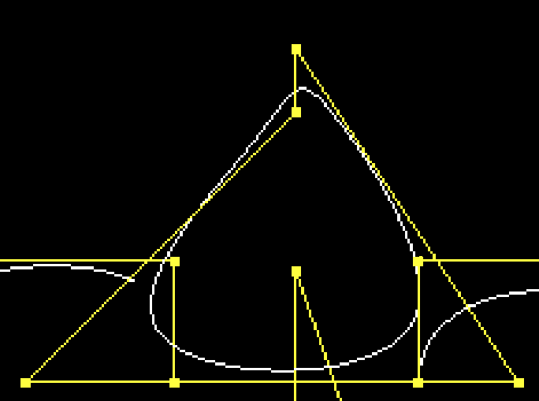

<font size = "6em" ><bold>**PA1: 光线投射** &nbsp;&nbsp;</bold></font> <small>2021080070 计14 韩佑硕 </small> 

# **1.曲线性质**
## **1-1. Bezier 曲线和 B 样条曲线的区别**
## **1-1-1. 相同点**
1. Bezier曲线实际上是B-spline条曲线的一个特例，所以二者都可以用De Boor算法来计算。
## **1-1-2. 不同点**
1. Bezier曲线不支持局部的修改和编辑，曲线中的每一点都会受到所有控制点的影响。
2. B-spline曲线可以连接，而Bezier曲线在连接时很难满足几何连续性条件。
3. B-spline曲线的控制点数量不取决于曲线的数量，所以B-spline的自由度很高，可以定义很多控制点，且不用担心曲线的数量太多而无法计算的情况。
## **1-2. 怎样绘制一个首尾相接且接点处也有连续性质的B样条**
采用周期性循环的控制点集。即，$\{P_0, P_1, P_2, ..., P_n, P_0 P_1,...,P_n\}$  
这样所画出来的B样条能保证首尾相接且节点处具有连续性。  
以本次实验的scene08为例，
```
    BsplineCurve {
        controls
            [ -2 0 1 ]
            [ 0 2 1 ]
            [ 0 3 -1 ]
            [ 2 0 -1 ]
            [ -2 0 1 ]
            [ 0 2 1 ]
            [ 0 3 -1 ]
            [ 2 0 -1 ]            
    }
```
这样修改控制点会得出如下B样条曲线  



# **2.代码逻辑**
关于PA1代码的合并部分不做解释了。  
总体而言，本人不是在BsplineCurve的基础上把BezierCurve当做特殊情况处理，而是分别实现了BezierCurve的discretize和
BsplineCurve的discretize。

## **2-1. Curve**
由于上述理由，Curve类只添加了储存控制点个数和次数的两个变量。
```c++
    int NCP, degree; // Numbe of control points, and degree of curve
```

## **2-2. BezierCurve**
### **2-2-1. 构造函数**
在构造函数中，设置控制点个数和次数。
### **2-2-2. discretize**
把resolution当做离散化后[0,1]区间中的点的个数。  
具体步骤如下  
1. Calculate t
2. Get Bernstein basis
3. Calculate the Derivatives
4. store the value into data(参数)
其中，第二步和第三部分别用到如下2个函数。
```c++
protected:
    double get_Bernstein(int i,int n, double t){
        return C(n,i) * pow(t,i) * pow(1-t,n-i);
    }
    double get_DBernstein(int i, int n,double t){
        if(i==0) return -1*(double)n*pow(1-t,n-1); //边界
        if(i==n) return (double)n*pow(t,n-1); //边界
        return (double)n*(get_Bernstein(i-1,n-1,t) - get_Bernstein(i,n-1,t));
    }
```

## **2-3. BsplineCurve**
### **2-3-1. 构造函数**
在构造函数中，设置控制点个数和次数。
### **2-3-2. discretize**
把resolution当做离散化后$[t_i,t_{i+1}]$区间中的点的个数。  
具体步骤如下  
1. Resize data
2. Get the index of Control points, that are effective at this iteration.
3. Calculate t
4. Get the Bernstein basis
5. Calculate the Derivatives
6. store the value into data(参数)
其中，第4步和第5部分别用到如下2个函数。  
```C++
    double get_Bernstein(int i,int p,double t){
        if(p <= 0){
            if(t >= Knots[i] && t <Knots[i+1])
                return 1;
            else 
                return 0;
        } else {
            double a = (t - Knots[i])/(Knots[i+p] - Knots[i]);
            double b = (Knots[i+p+1] - t)/(Knots[i+p+1] - Knots[i+1]);
            return a*get_Bernstein(i,p-1,t) + b*get_Bernstein(i+1,p-1,t);
        }
    }
    double get_DBernstein(int i, int p, double t){
        return (double) p * (get_Bernstein(i,p-1,t)/(Knots[i+p] - Knots[i]) - get_Bernstein(i+1,p-1,t)/(Knots[i+p+1] - Knots[i+1]));
    }
```
# **3. 代码参考**
没有参考任何的网上的代码，自己完成了PA。
